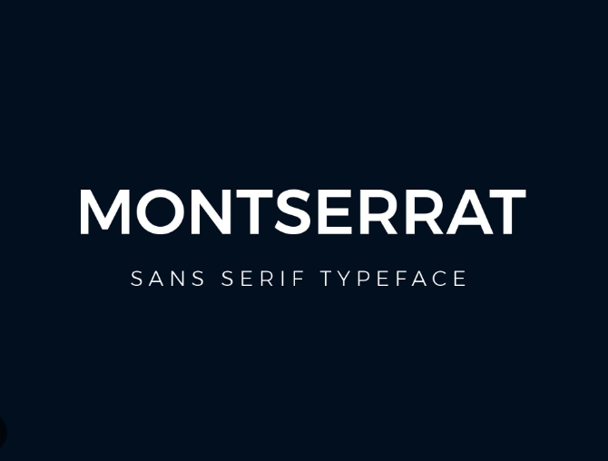
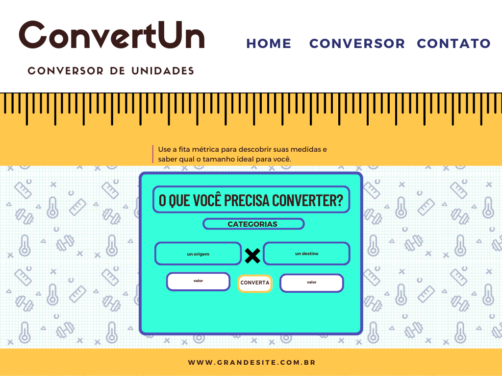

# Conversor de Unidades | ConvertUn

**Descrição:** Projeto individual intitulado _“Conversor de Unidades”_ desenvolvido durante o _Módulo 2 - Orientação a objetos e Inteligência emocional_ do curso de formação _WebDev Full Stack JavaScript_ da _Resilia Educação_ em parceria com o programa _Códigos do Amanhã_ da _EBANX_.

**Objetivo:** O projeto consiste no desenvolvimento de uma one page website utilizando HTML, CSS e JS. O conteúdo da página é um "Conversor de Unidades de Medida" que converte comprimento (metros, polegadas e centímetros), massa (gramas, libras e quilogramas) e temperatura (Celsius, Fahrenheit e Kelvin).

**Link da página:** https://devtaw.github.io/unit-converter-convertun/

## ➡️ Fonte utilizada no projeto:

## ➡️ Paleta de cores utilizada no projeto:

## ➡️ Protótipo de baixa fidelidade do projeto:

## 🤝 Colaboradores

<table>
  <tr>
    <td align="center">
      <a href="#">
         
        
          <b>Tawany Simões (Taw)</b>
        
      </a>
    </td>
  </tr>
 </table>
